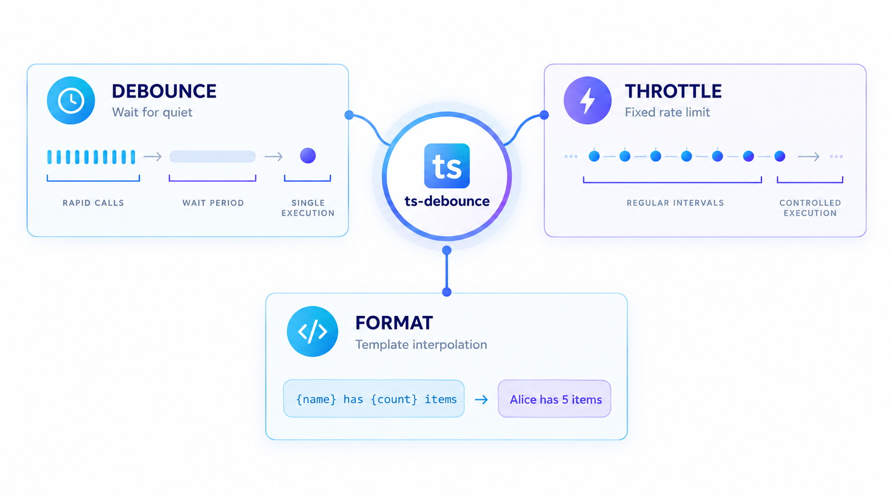

# ts-debounce

> **Lightweight, zero-dependency TypeScript utilities for debouncing, throttling, and string formatting.**



[](https://www.npmjs.com/package/ts-debounce)
[](https://github.com/OMD-123/ts-debounce/actions)
[](https://opensource.org/licenses/MIT)
[](https://www.typescriptlang.org/)
[](https://bundlephobia.com/package/ts-debounce)

---

## 🚀 Why Use ts-debounce?

When you need precise control over function execution timing without the overhead of a massive utility library.

| Problem | Solution |
|---------|----------|
| **Too many API calls** from user input | `debounce` - Wait until user stops typing |
| **Excessive event handlers** (scroll, resize, mousemove) | `throttle` - Limit to fixed rate |
| **String concatenation** with variables | `format` - Clean template strings with named/indexed placeholders |
| **Heavy lodash dependency** for simple utils | **Zero dependencies**, ~2KB gzipped |

### 🌟 Key Features

- **🎯 Zero Dependencies** - No external runtime dependencies, keeping your bundle lean.
- **📦 Tiny Footprint** - ~2KB minzipped (compared to 25KB+ for lodash equivalents).
- **🏷️ First-Class TypeScript** - Full type inference and definitions provided.
- **🌍 Universal Compatibility** - Native support for Node.js, Browsers, Deno, and Bun.
- **🧪 High Confidence** - 100% coverage on core utility logic with comprehensive tests.
- **📖 Production-Ready** - Implements standard patterns for reliability and performance.

---

## 🛠️ Installation

```bash
# npm
npm install ts-debounce

# yarn
yarn add ts-debounce

# pnpm
pnpm add ts-debounce
```

---

## ⚡ Quick Start

```typescript
import { debounce, throttle, format } from 'ts-debounce';

// 1. Debounce: Wait for user to stop typing before searching
const searchAPI = debounce((query: string) => {
  fetch(`/api/search?q=${query}`).then(res => res.json());
}, 300);

// 2. Throttle: Limit a scroll handler to ~60fps to prevent layout thrashing
const onScroll = throttle(() => {
  updateScrollPosition();
}, 16);

// 3. Format: Replace placeholders with clean templates
const welcome = format('Hello {0}, welcome to {1}!', 'Alice', 'TypeScript');
// → "Hello Alice, welcome to TypeScript!"

const template = format('User: {name}, Role: {role}', { name: 'Bob', role: 'Admin' });
// → "User: Bob, Role: Admin"
```

---

## 📖 API Reference

### `debounce<T extends (...args: any[]) => any>(fn: T, wait: number, options?: DebounceOptions): DebouncedFunction<T>`

Prevents a function from being called too frequently. The target function will only be executed after `wait` milliseconds have passed since the last call.

#### Options
- `leading` (boolean): Invoke on the leading edge. Defaults to `false`.
- `trailing` (boolean): Invoke on the trailing edge. Defaults to `true`.
- `maxWait` (number): The maximum time `fn` is allowed to be delayed before it's executed.

#### Usage
```typescript
const debounced = debounce(() => console.log('Saved!'), 1000);
debounced(); // Timer starts
debounced(); // Timer resets
// ... 1s later ... "Saved!"
```

---

### `throttle<T extends (...args: any[]) => any>(fn: T, wait: number, options?: ThrottleOptions): ThrottledFunction<T>`

Ensures a function is called at most once per every `wait` milliseconds.

#### Options
- `leading` (boolean): Invoke on the leading edge. Defaults to `true`.
- `trailing` (boolean): Invoke on the trailing edge. Defaults to `true`.

#### Usage
```typescript
const throttled = throttle(() => console.log('Tick!'), 100);
throttled(); // Executed immediately
throttled(); // Ignored
// ... 100ms later ...
throttled(); // Executed again
```

---

### `format(template: string, ...args: any[]): string`
### `format(template: string, values: Record<string, any>): string`

Professional string interpolation with support for indexed and named placeholders.

#### Features
- **Indexed**: `{0}, {1}`...
- **Named**: `{name}, {id}`...
- **Escaping**: `{{` and `}}` for literal braces.
- **Nested**: Support for dot notation (e.g., `{user.name}`).

#### Usage
```typescript
// Indexed
format('Item {0} of {1}', 1, 10); // "Item 1 of 10"

// Named
format('Hello {name}', { name: 'Om' }); // "Hello Om"

// Nested
format('Role: {user.role}', { user: { role: 'Admin' } }); // "Role: Admin"
```

---

## 🌍 Real-World Examples

### 🔍 Search Autocomplete (Debounce)
Wait until the user stops typing before hitting the API to save server resources.

```typescript
const debouncedSearch = debounce(async (query: string) => {
  const results = await api.search(query);
  render(results);
}, 300);

input.addEventListener('input', (e) => debouncedSearch(e.target.value));
```

### 📜 Infinite Scroll (Throttle)
Limit the frequency of scroll-position checks to maintain 60fps performance.

```typescript
const onScroll = throttle(async () => {
  if (atBottom()) await loadMore();
}, 200);

window.addEventListener('scroll', onScroll);
```

### 💾 Form Auto-Save (Debounce + maxWait)
Save drafts automatically, but force a save every 10 seconds regardless of typing.

```typescript
const autoSave = debounce(() => saveDraft(), 2000, { maxWait: 10000 });
input.addEventListener('input', autoSave);
```

### 🌈 i18n / Logging (Format)
Create clean, localized strings or formatted logs.

```typescript
const log = (msg: string, meta: any) => 
  console.log(format('[{time}] {msg} | {meta}', { 
    time: new Date().toISOString(), 
    msg, 
    meta: JSON.stringify(meta) 
  }));
```

---

## 🛠️ Technical Specifications

### Comparison with Alternatives

| Feature | ts-debounce | lodash.debounce | just-debounce-it |
|---------|-------------|-----------------|------------------|
| **Bundle Size** | **~2KB** | ~8KB | ~1KB |
| **TypeScript** | ✅ Native | ✅ @types | ✅ Native |
| **Debounce** | ✅ | ✅ | ✅ |
| **Throttle** | ✅ | ❌ | ❌ |
| **Format** | ✅ | ❌ | ❌ |
| **maxWait** | ✅ | ✅ | ❌ |
| **Leading/Trailing** | ✅ | ✅ | ✅ |

### Environment Support

| Env | Supported |
|-----|-----------|
| Node.js 14+ | ✅ |
| Browsers (Modern) | ✅ |
| Deno / Bun | ✅ |
| TypeScript 5.0+ | ✅ |

---

## 🤝 Contributing

We welcome contributions! Please see our [Contributing Guide](CONTRIBUTING.md) for details on how to set up the project and submit PRs.

### Good First Issues
Looking for a place to start? Check out our [issues](https://github.com/OMD-123/ts-debounce/issues) and look for the `good first issue` label.

---

## 📄 License

MIT License - see [LICENSE](LICENSE) for details.

---

## 📅 Changelog

See [CHANGELOG.md](CHANGELOG.md) for a full list of changes.
