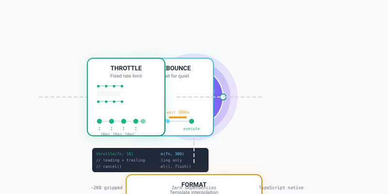

# ts-debounce

> **Lightweight, zero-dependency TypeScript utilities for debouncing, throttling, and string formatting.**



[](https://www.npmjs.com/package/ts-debounce)
[](https://github.com/OMD-123/ts-debounce/actions)
[](https://opensource.org/licenses/MIT)
[](https://www.typescriptlang.org/)
[](https://bundlephobia.com/package/ts-debounce)

---

## Why Use ts-debounce?

| Problem | Solution |
|---------|----------|
| **Too many API calls** from user input | `debounce` - Wait until user stops typing |
| **Excessive event handlers** (scroll, resize, mousemove) | `throttle` - Limit to fixed rate |
| **String concatenation** with variables | `format` - Clean template strings with named/indexed placeholders |
| **Heavy lodash dependency** for simple utils | **Zero dependencies**, ~2KB gzipped |

### Key Features

- **🎯 Zero Dependencies** - No external runtime dependencies
- **📦 Tiny** - ~2KB minzipped (vs 25KB for lodash.debounce)
- **🏷️ Full TypeScript** - Complete type definitions included
- **🌍 Universal** - Works in Node.js, browsers, Deno, Bun
- **🧪 Well-Tested** - 12 comprehensive unit tests
- **📖 Battle-Tested Patterns** - Standard implementations used in production

---

## How It Works


*Visual overview of the three core utilities and their execution patterns.*

---

## Installation

```bash
# npm
npm install ts-debounce

# yarn
yarn add ts-debounce

# pnpm
pnpm add ts-debounce
```

---

## Quick Start

```typescript
import { debounce, throttle, format } from 'ts-debounce';

// Debounce: Wait for user to stop typing
const searchAPI = debounce((query: string) => {
  fetch(`/api/search?q=${query}`).then(res => res.json());
}, 300);

// Throttle: Limit scroll handler to 60fps
const onScroll = throttle(() => {
  updateScrollPosition();
}, 16); // ~60fps

// Format: Clean string templates
const welcome = format('Hello {0}, welcome to {1}!', 'Alice', 'TypeScript');
// → "Hello Alice, welcome to TypeScript!"

const template = format('User: {name}, Role: {role}', { name: 'Bob', role: 'Admin' });
// → "User: Bob, Role: Admin"
```

---

## API Reference

### `debounce<T extends (...args: any[]) => any>(
  fn: T,
  wait: number,
  options?: DebounceOptions
): DebouncedFunction<T>`

Creates a debounced function that delays invoking `fn` until after `wait` milliseconds have elapsed since the last time it was invoked.

```typescript
import { debounce } from 'ts-debounce';

// Basic usage
const debouncedFn = debounce(() => console.log('Called!'), 300);

debouncedFn(); // Nothing happens yet
debouncedFn(); // Timer resets
// ... 300ms later ...
// "Called!" (only once)
```

#### Options

```typescript
interface DebounceOptions {
  leading?: boolean;    // Invoke on leading edge (default: false)
  trailing?: boolean;   // Invoke on trailing edge (default: true)
  maxWait?: number;     // Maximum wait time before forced invocation
}
```

#### Common Patterns

```typescript
// Search input - trailing only (default)
const search = debounce((query) => api.search(query), 300);

// Button click - leading edge (immediate feedback)
const submit = debounce(() => api.submit(form), 1000, { leading: true, trailing: false });

// Auto-save - with maxWait to ensure eventual save
const autoSave = debounce(() => saveDraft(), 2000, { maxWait: 10000 });

// Cancel pending invocation
const debouncedSearch = debounce(searchAPI, 300);
input.addEventListener('input', (e) => debouncedSearch(e.target.value));

// Later: cancel any pending search
debouncedSearch.cancel();

// Flush immediately (execute if pending)
debouncedSearch.flush();
```

---

### `throttle<T extends (...args: any[]) => any>(
  fn: T,
  wait: number,
  options?: ThrottleOptions
): ThrottledFunction<T>`

Creates a throttled function that only invokes `fn` at most once per every `wait` milliseconds.

```typescript
import { throttle } from 'ts-debounce';

// Basic usage - limit to once per 100ms
const throttledFn = throttle(() => console.log('Called!'), 100);

throttledFn(); // Called immediately
throttledFn(); // Ignored
throttledFn(); // Ignored
// ... 100ms later ...
throttledFn(); // Called again
```

#### Options

```typescript
interface ThrottleOptions {
  leading?: boolean;   // Invoke on leading edge (default: true)
  trailing?: boolean;  // Invoke on trailing edge (default: true)
}
```

#### Common Patterns

```typescript
// Scroll handler - 60fps max
const onScroll = throttle(() => {
  updateParallax();
  checkVisibility();
}, 16); // ~60fps

// Resize handler - limit reflow calculations
const onResize = throttle(() => {
  recalculateLayout();
}, 100, { leading: true, trailing: true });

// Mousemove - trailing only (smoother)
const onMouseMove = throttle((e) => {
  updateCursorPosition(e.clientX, e.clientY);
}, 16, { leading: false, trailing: true });

// Cancel pending
const throttledResize = throttle(handleResize, 100);
window.addEventListener('resize', throttledResize);
// Later:
throttledResize.cancel();
```

---

### `format(template: string, ...args: any[]): string`
### `format(template: string, values: Record<string, any>): string`

Formats a string with placeholders. Supports both indexed (`{0}`, `{1}`) and named (`{name}`) placeholders.

```typescript
import { format } from 'ts-debounce';

// Indexed placeholders
format('Hello {0}, you have {1} messages', 'Alice', 5);
// → "Hello Alice, you have 5 messages"

// Named placeholders (object)
format('User: {name}, Email: {email}', { name: 'Bob', email: 'bob@example.com' });
// → "User: Bob, Email: bob@example.com"

// Mixed (object takes precedence for named, array for indexed)
format('{0} and {name}', ['first'], { name: 'second' });
// → "first and second"

// Escaping braces
format('{{literal}} and {0}', 'placeholder');
// → "{literal} and placeholder"

// Nested objects (dot notation)
format('User: {user.name}, Role: {user.role}', { user: { name: 'Alice', role: 'Admin' } });
// → "User: Alice, Role: Admin"
```

---

## Real-World Examples

### 1. Search Autocomplete (Debounce)

```typescript
// search.ts
import { debounce } from 'ts-debounce';

interface SearchResult {
  id: string;
  title: string;
  description: string;
}

const searchInput = document.getElementById('search') as HTMLInputElement;
const resultsContainer = document.getElementById('results') as HTMLDivElement;

async function fetchResults(query: string): Promise<SearchResult[]> {
  const response = await fetch(`/api/search?q=${encodeURIComponent(query)}`);
  return response.json();
}

function renderResults(results: SearchResult[]) {
  resultsContainer.innerHTML = results
    .map(r => `<div class="result">${r.title}</div>`)
    .join('');
}

// Debounced search - waits 300ms after user stops typing
const debouncedSearch = debounce(async (query: string) => {
  if (!query.trim()) {
    resultsContainer.innerHTML = '';
    return;
  }
  try {
    const results = await fetchResults(query);
    renderResults(results);
  } catch (error) {
    console.error('Search failed:', error);
  }
}, 300);

searchInput.addEventListener('input', (e) => {
  debouncedSearch((e.target as HTMLInputElement).value);
});

// Cleanup on page unload
window.addEventListener('beforeunload', () => debouncedSearch.cancel());
```

### 2. Infinite Scroll (Throttle)

```typescript
// infinite-scroll.ts
import { throttle } from 'ts-debounce';

let page = 1;
let loading = false;
const observer = new IntersectionObserver(
  throttle(async (entries) => {
    const target = entries[0];
    if (target.isIntersecting && !loading) {
      loading = true;
      await loadMore();
      loading = false;
    }
  }, 200), // Check at most every 200ms
  { rootMargin: '100px' }
);

async function loadMore() {
  const response = await fetch(`/api/items?page=${page++}`);
  const items = await response.json();
  appendItems(items);
}

function appendItems(items: any[]) {
  const container = document.getElementById('feed');
  items.forEach(item => {
    const el = document.createElement('div');
    el.textContent = item.title;
    container?.appendChild(el);
  });
}

// Observe sentinel element
const sentinel = document.getElementById('sentinel');
if (sentinel) observer.observe(sentinel);
```

### 3. Window Resize Handler (Throttle)

```typescript
// resize-handler.ts
import { throttle } from 'ts-debounce';

interface LayoutMetrics {
  width: number;
  height: number;
  breakpoint: 'mobile' | 'tablet' | 'desktop';
}

function calculateLayout(): LayoutMetrics {
  const width = window.innerWidth;
  const height = window.innerHeight;
  let breakpoint: LayoutMetrics['breakpoint'] = 'desktop';
  
  if (width < 768) breakpoint = 'mobile';
  else if (width < 1024) breakpoint = 'tablet';
  
  return { width, height, breakpoint };
}

// Only recalculate layout at most every 100ms
const handleResize = throttle(() => {
  const layout = calculateLayout();
  
  // Update CSS custom properties
  document.documentElement.style.setProperty('--viewport-width', `${layout.width}px`);
  document.documentElement.style.setProperty('--viewport-height', `${layout.height}px`);
  
  // Dispatch custom event for other components
  window.dispatchEvent(new CustomEvent('layout-change', { detail: layout }));
  
  console.log('Layout updated:', layout);
}, 100, { leading: true, trailing: true });

window.addEventListener('resize', handleResize);

// Cleanup
// handleResize.cancel();
```

### 4. Form Auto-Save (Debounce + maxWait)

```typescript
// auto-save.ts
import { debounce } from 'ts-debounce';

interface FormData {
  title: string;
  content: string;
  tags: string[];
}

const form = document.getElementById('editor') as HTMLFormElement;
const STORAGE_KEY = 'draft-form-data';

function saveDraft(data: FormData) {
  localStorage.setItem(STORAGE_KEY, JSON.stringify(data));
  console.log('Draft saved at', new Date().toISOString());
}

function loadDraft(): FormData | null {
  const saved = localStorage.getItem(STORAGE_KEY);
  return saved ? JSON.parse(saved) : null;
}

// Auto-save: debounce 2s, but force save at least every 10s
const autoSave = debounce(
  () => {
    const formData = new FormData(form);
    const data = Object.fromEntries(formData) as FormData;
    saveDraft(data);
  },
  2000,
  { maxWait: 10000 }
);

// Attach to all form inputs
form.querySelectorAll('input, textarea, select').forEach(input => {
  input.addEventListener('input', () => autoSave());
});

// Load existing draft on init
const draft = loadDraft();
if (draft) {
  Object.entries(draft).forEach(([key, value]) => {
    const input = form.querySelector(`[name="${key}"]`) as HTMLInputElement;
    if (input) input.value = value;
  });
}
```

### 5. String Formatting for Logging/i18n

```typescript
// logger.ts
import { format } from 'ts-debounce';

type LogLevel = 'debug' | 'info' | 'warn' | 'error';

interface LogEntry {
  level: LogLevel;
  message: string;
  timestamp: string;
  context?: Record<string, any>;
}

const LEVEL_COLORS: Record<LogLevel, string> = {
  debug: '\x1b[36m',   // cyan
  info: '\x1b[32m',    // green
  warn: '\x1b[33m',    // yellow
  error: '\x1b[31m',   // red
};
const RESET = '\x1b[0m';

function formatLog(entry: LogEntry): string {
  const color = LEVEL_COLORS[entry.level];
  const base = format('[{timestamp}] {level}: {message}', {
    timestamp: entry.timestamp,
    level: entry.level.toUpperCase(),
    message: entry.message,
  });
  
  if (entry.context) {
    const contextStr = format(' | Context: {context}', {
      context: JSON.stringify(entry.context)
    });
    return `${color}${base}${contextStr}${RESET}`;
  }
  
  return `${color}${base}${RESET}`;
}

// Usage
const log = (level: LogLevel, message: string, context?: Record<string, any>) => {
  const entry: LogEntry = {
    level,
    message,
    timestamp: new Date().toISOString(),
    context,
  };
  console.log(formatLog(entry));
};

log('info', 'Server started', { port: 3000, env: 'production' });
log('error', 'Database connection failed', { retries: 3, lastError: 'ECONNREFUSED' });
```

### 6. React Hook Integration

```typescript
// useDebounce.ts
import { useCallback, useRef, useEffect } from 'react';
import { debounce, DebouncedFunction } from 'ts-debounce';

export function useDebouncedCallback<T extends (...args: any[]) => any>(
  callback: T,
  wait: number,
  options?: { leading?: boolean; trailing?: boolean; maxWait?: number }
): DebouncedFunction<T> {
  const debouncedRef = useRef<DebouncedFunction<T>>();
  
  if (!debouncedRef.current) {
    debouncedRef.current = debounce(callback, wait, options);
  }
  
  // Update callback reference without changing debounce timing
  useEffect(() => {
    debouncedRef.current!.fn = callback;
  }, [callback]);
  
  // Cleanup on unmount
  useEffect(() => {
    return () => debouncedRef.current?.cancel();
  }, []);
  
  return debouncedRef.current;
}

// Usage in component
function SearchComponent() {
  const [query, setQuery] = useState('');
  const [results, setResults] = useState([]);
  
  const debouncedSearch = useDebouncedCallback(
    async (q: string) => {
      const data = await fetch(`/api/search?q=${q}`).then(r => r.json());
      setResults(data);
    },
    300
  );
  
  return (
    <input
      value={query}
      onChange={(e) => {
        setQuery(e.target.value);
        debouncedSearch(e.target.value);
      }}
      placeholder="Search..."
    />
  );
}
```

---

## Comparison with Alternatives

| Feature | ts-debounce | lodash.debounce | lodash.throttle | just-debounce-it |
|---------|-------------|-----------------|-----------------|------------------|
| **Size (gzipped)** | ~2KB | ~8KB | ~8KB | ~1KB |
| **Dependencies** | 0 | 0 | 0 | 0 |
| **TypeScript** | ✅ Native | ✅ @types | ✅ @types | ✅ Native |
| **Debounce** | ✅ | ✅ | ❌ | ✅ |
| **Throttle** | ✅ | ❌ | ✅ | ❌ |
| **Format** | ✅ | ❌ | ❌ | ❌ |
| **maxWait** | ✅ | ✅ | ❌ | ❌ |
| **Leading/Trailing** | ✅ | ✅ | ✅ | ✅ |
| **Cancel/Flush** | ✅ | ✅ | ✅ | ✅ |
| **ESM + CJS** | ✅ | ✅ | ✅ | ✅ |

---

## TypeScript Usage

Full type inference works out of the box:

```typescript
import { debounce, throttle, format } from 'ts-debounce';

// Types inferred automatically
const debounced = debounce((x: number, y: string) => x + y.length, 100);
//    ^? DebouncedFunction<(x: number, y: string) => number>

const throttled = throttle((user: { id: number; name: string }) => user.id, 50);
//    ^? ThrottledFunction<(user: { id: number; name: string }) => number>

const formatted = format('User {0} has role {role}', 'alice', { role: 'admin' });
//    ^? string
```

### Extended Types

```typescript
import type { DebounceOptions, ThrottleOptions, DebouncedFunction, ThrottledFunction } from 'ts-debounce';

// Use types directly
const options: DebounceOptions = { leading: true, maxWait: 5000 };
const fn: DebouncedFunction<(x: number) => void> = debounce(console.log, 100, options);
```

---

## Browser Support

| Environment | Supported |
|-------------|-----------|
| Chrome 60+ | ✅ |
| Firefox 55+ | ✅ |
| Safari 11+ | ✅ |
| Edge 79+ | ✅ |
| Node.js 14+ | ✅ |
| Deno 1.0+ | ✅ |
| Bun 1.0+ | ✅ |

---

## Contributing

We welcome contributions! Please see our [Contributing Guide](CONTRIBUTING.md) for details.

### Good First Issues

- [Add usage examples to README](https://github.com/OMD-123/ts-debounce/issues/1) 🏷️ `good first issue`
- [Add edge-case tests](https://github.com/OMD-123/ts-debounce/issues?q=is%3Aissue+is%3Aopen+label%3A%22good+first+issue%22)

### Development

```bash
# Install dependencies
npm install

# Run tests
npm test

# Build
npm run build

# Type check
npm run typecheck
```

---

## License

MIT License - see [LICENSE](LICENSE) for details.

---

## Changelog

### v1.0.0 (2026-09-27)
- Initial release
- `debounce`, `throttle`, `format` utilities
- Full TypeScript support
- 12 unit tests
- Zero dependencies

---

## Related Projects

- [agent-loop-guard](https://github.com/OMD-123/agent-loop-guard) - Prevent infinite loops in AI agents
- [lodash](https://lodash.com/) - Full utility library (heavier alternative)

---

**Made with ❤️ by [Om Dandagvhal](https://github.com/OMD-123)**